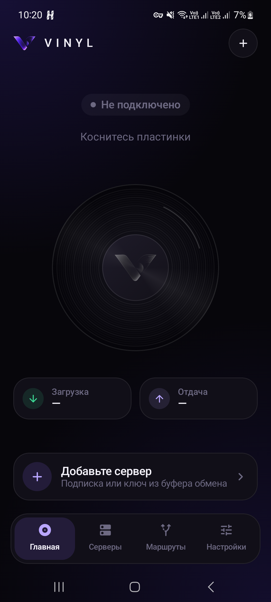
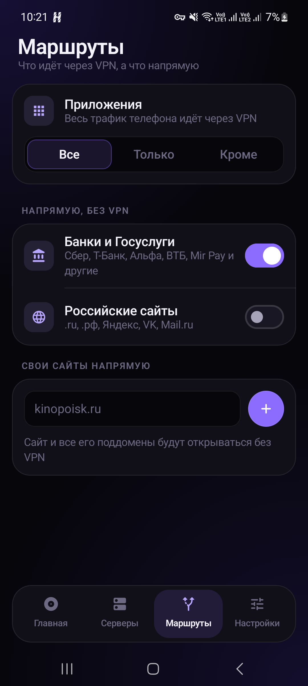
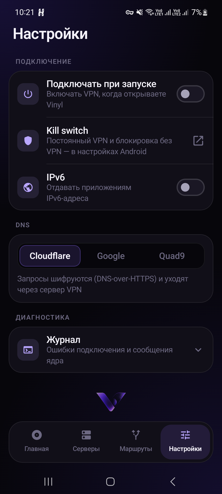

<p align="center">
  
</p>

# Vinyl

VPN клиент под андроид. Хотел свой клиент типа Happ, только чтобы выглядел нормально и ничего лишнего. Внутри ядро sing-box (libbox), интерфейс на Jetpack Compose.

<p align="center">
  
  
  
</p>

### Что умеет

- подписки по ссылке (base64 или просто списком), обновление, остаток трафика и дата окончания если панель это отдает
- ключи vless (reality, tls, ws, grpc, httpupgrade), vmess, trojan, shadowsocks, hysteria2, tuic, wireguard
- можно вставить сразу пачку ключей из буфера или отсканировать QR
- плитка в шторке для быстрого включения
- автовыбор сервера по пингу
- раздельное туннелирование по приложениям: все / только выбранные / все кроме выбранных
- банки, госуслуги и ру сайты можно пустить мимо впн одной галочкой
- свои сайты напрямую
- DNS через DoH внутри туннеля (Cloudflare, Google, Quad9)
- журнал ошибок, чтобы понять почему не подключается

XHTTP не работает и вряд ли заработает скоро: его не умеет само ядро sing-box (в Happ поддержка есть потому что там внутри Xray, другое ядро). Такие сервера в списке показываются серыми. Чтобы их завести, надо прикручивать второе ядро, это отдельная большая переделка.

### Сборка

Проще всего открыть проект в Android Studio и нажать Run.

Или из консоли:

```
./gradlew assembleRelease
```

apk будет в `app/build/outputs/apk/release/`. Релиз пока подписан debug ключом, так что ставится без проблем.

Минимальный андроид 8.0 (API 26).

Релиз подписывается своим ключом если рядом положить `keystore.properties` (в репо его нет, лежит только локально). Без него собирается debug-ключом, тоже ставится.

Тесты парсера и конфига:

```
./gradlew testDebugUnitTest
```

Ещё есть тест, который прогоняет собранные конфиги через настоящее ядро (запускать на телефоне или эмуляторе):

```
./gradlew connectedAndroidTest
```

### TODO

- [ ] живой скан QR камерой в самом приложении (сейчас через системный сканер google)
- [ ] тема посветлее
- [ ] второе ядро (xray) ради XHTTP, если руки дойдут

<br>

<p align="center">
  <sub>Developer <a href="https://github.com/claustrophobDev">claustrophobDev</a></sub>
</p>
